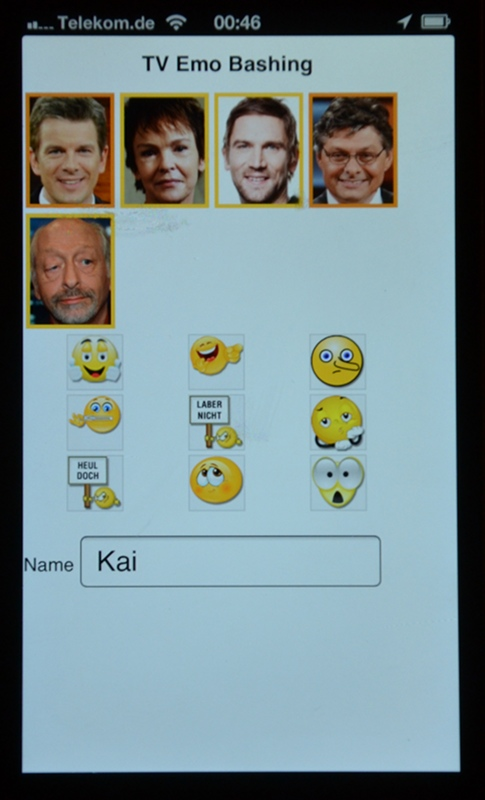

# TV Emo Bashing

A second screen app for live commenting on tv shows. You can comment on persons by moving emoticons onto the show guests. The icons appear on the tv screen including a notification. This was the first prize on the [TV Hackday 2013](http://tvhackday.com/).

## The Team

* Joan Chirila
* Susanne Heinz
* Anne Lorenz
* Kai Mysliwiec
* Jasper Sasse

Also thanks to Bertram Gugel, Philipp Sackl, Felix Segebrecht and Csongor Baranyai for the support and the great ideas. And of course the [BLM](http://www.medienpuls-bayern.de/)

## Installation

* Install [node.js](http://nodejs.org/download/)
* Install [GIT](http://git-scm.com/downloads)
* Clone this repo: git clone git@github.com:kaimys/social-tv.git
* Change to the new folder: cd social-tv
* Install node.js modules: npm install
* Start the server: node social-tv.js
* Enter your ip address of your computer into your browser e.g. http://10.0.0.1:7777/ . Don't use localhost or the qr-code will not work.
* Use the **p** key to start the video and **s** to show the fake statistics page

Have fun!
Kai
